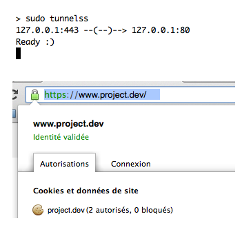

# Tunnelss

Tunnelss is a proxy from HTTPS to HTTP to help with web development over HTTPS.

It's like the [tunnels gem](https://github.com/jugyo/tunnels) (sure, it's a fork), but it does more, since it makes your HTTPS recognized as valid by the browser!

So now you can finally have a not-far-from-real SSL connection with Pow, with a minimum of efforts!



## The Magic

Tunnelss is a mix between the [tunnels gem](https://github.com/jugyo/tunnels) and the [powssl script](https://gist.github.com/paulnicholson/2050941).

1. It builds a root-level certificate (a Certificate Authority) and registers it as a trusted root certificate (you will need to do it manually for Firefox).
2. It generates a SSL certificate matching the Pow `.dev` domains.
2. It runs an EventMachine server which acts as proxy from HTTPS to HTTP (just like tunnels), using the generated certificate so that your browser will not complain your SSL connection is not valid!

## Why?

Because:

* setting up Nginx to do reverse-proxying for development is overkill,
* you would have to add a Nginx config file each time you start a new project,
* you like the `.dev` domains provided by Pow,
* you want to run your app over SSL just like in production so that you can check the redirections,
* working with external APIs over HTTPS, secured cookies and CORS seems really difficult if your SSL certificate is not valid (your browser may refuse to perform CORS requests),
* your app server needs to know that the request was over HTTPS, even if it was proxied to HTTP (which the powssl script which uses Stud doesn't allow).

## Disclaimer

This gem is in early developments and has only been tested under MacOS X 10.8. It may not work in other environments, but feel free to submit pull requests if you make the necessary fixes.

## Installation

    $ gem install tunnelss

If you're using rbenv:

    $ rbenv rehash

## Run

    $ sudo tunnelss

Don't worry, the first time you launch it it will generate a certificate and ask for your permission to add it to trusted authorities (see _The Magic_ above for more details).

If you are using rvm:

    $ rvmsudo tunnelss

By default, proxy to 80 port from 443 port.

Specify HTTP port and HTTPS port with:

    $ sudo tunnelss 443 3000

or

    $ sudo tunnelss 127.0.0.1:443 127.0.0.1:3000

## Configure

Tunnelss looks at your `~/.pow` directory and `~.powconfig` to determine which domains and domain extensions to create certificates for. If you would like to create a validate certificate for a domain that isn't served by pow, simply add a blank file to `~/.pow` with the name of the domain without the extension.

For example:

```bash
$ touch ~/.pow/mygreatapp
$ sudo tunnelss
```

If you'd like tunnelss to generate certificates valid for additional domain extensions, add the extension to `POW_DOMAINS`.

For an example of getting pow and non-pow served applications running alongside each other, with SSL certificates managed and served by tunnelss, [check out this blog post](http://mikebian.co/https-pow-ssl-rails-apache-development/).

Here are some other helpful resources on self-signing local SSL:

* https://gist.github.com/paulnicholson/2050941
* https://gist.github.com/mtigas/952344

If you need to regenerate the certificates:

```
rm -Rf ~/.tunnelss/
```

Note that it's possible that MacOS won't accept the certs that are generated.
If this occurs you may need to jump into the keychain and mark the `*.dev` cert as "Always Allow".

## Contributing

Run from the local source code:

    $ sudo bundle exec script/run

Feel free to submit pull requests. Please document your changes in the description.

## History

### 0.1.3

- Updated README
- Added script/run to run from local source
- Support multiple POW suffixes (https://github.com/rchampourlier/tunnelss/pull/2)
- Using SHA256 (https://github.com/rchampourlier/tunnelss/pull/3)

### 0.1.2

- Fix in README
- Removed dependency on Pry

### 0.1.1

Fixed 2 issues:

- When generating the certificate again, the index was not incremented, preventing the certificate generation commands from running.
- `openssl.cnf` file was generated with wrong DNS domains, subdomains were OK but main domains were lacking the `.dev`.

### 0.1.0

Initial release based on tunnels 1.2.2.

## Credits

* [tunnels](https://github.com/jugyo/tunnels) from which most code comes
* [powssl](https://gist.github.com/paulnicholson/2050941), a gist of Paul Nicholson which I translated to Ruby to perform Tunnelss certificate configuration based on Pow's.

## Copyright

[tunnelss](http://github.com/rchampourlier/tunnelss)
Copyright (c) 2013 rchampourlier, released under the MIT license.

[tunnels](https://github.com/jugyo/tunnels)
Copyright (c) 2012 jugyo, released under the MIT license.
